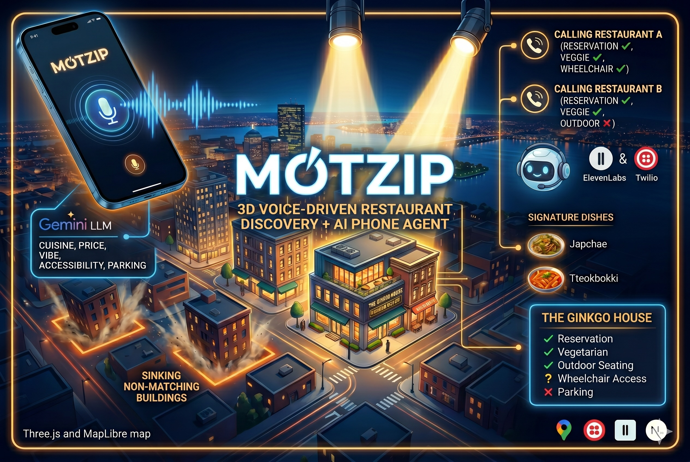
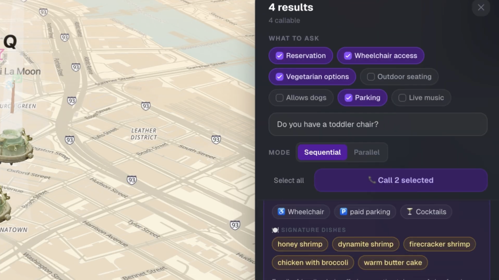
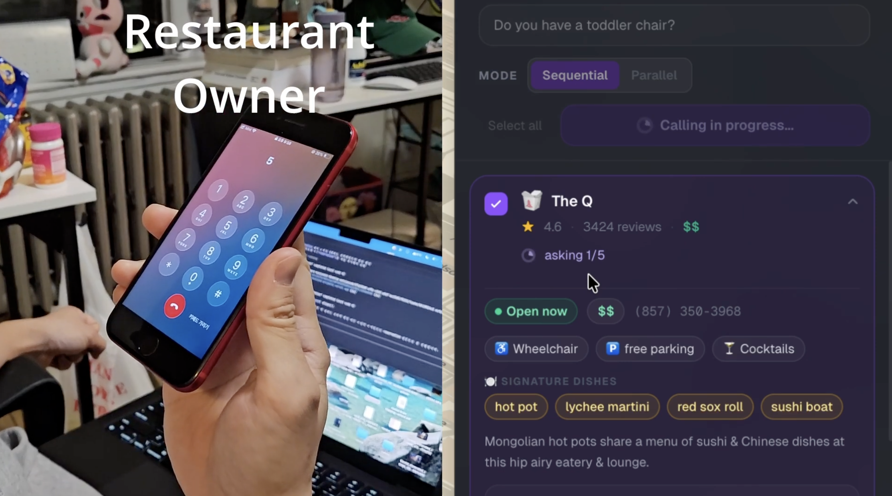
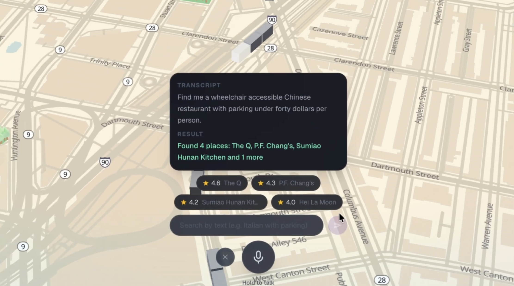

<div align="center">

### 🏗️ Next-Gen Hacks Beta · Spring 2026 — submission complete · judging in progress

# 🍴 MotZip

**Restaurants, by voice. The phone call is the new search bar.**

Speak what you actually want, watch a 3D map filter to your candidates,
then have an AI agent call every restaurant in parallel and return ✓/✗/?
answers — reservations, accessibility, parking, allergens — in any language.

[](#hackathon-context)
[](https://www.youtube.com/watch?v=y0-sebdw99I)
[](https://motzip.vercel.app)

**Next-Gen Hacks Beta · Spring 2026** · Voice + 3D + Real-time Communication tracks

<a href="https://www.youtube.com/watch?v=y0-sebdw99I">
  
</a>

</div>

---

## Table of contents

- [What MotZip does](#what-motzip-does)
- [Autocall in action](#autocall-in-action)
- [Live surfaces](#live-surfaces)
- [Architecture](#architecture)
- [Core flows](#core-flows)
- [Hackathon context](#hackathon-context)
- [Credits](#credits)
- [For developers](#for-developers)

---

## What MotZip does

<p align="center">
  
</p>

A two-step experience, both backed by a real FastAPI backend on Cloud Run:

| # | Surface | What happens | Data source |
|---|---------|--------------|-------------|
| 1 | **3D map** | Restaurants render as TRELLIS-generated GLB icons floating over MapLibre + Three.js. Beam height = rating tier (gold/silver/bronze). Crowd queue = popularity. | **Google Places API (New)** — `searchNearby` ×7 cuisine groups (39 → 98 restaurants in the demo region) |
| 2 | **Voice search** | Hold the mic, speak in English or Korean: *"quiet date spot, korean food, under $40, with cocktails."* Non-matching food sinks into the ground; matches stay lit. A friendly voice speaks the count and top picks back. | **Google Cloud STT** + **Gemini 2.0 Flash** (filter extraction) + **Google Cloud TTS** |
| 3 | **Restaurant panel** | Click any food icon → details, photos, hours. On demand, extract **signature dishes** from real Google reviews with one LLM call. | **Google Places** + **Gemini** |
| 4 | **Batch phone calls** | Pick the questions you actually care about (reservations, vegetarian, wheelchair access, outdoor seating, parking, dogs, live music) plus a free-form question in any language. Click "Call N selected." Each restaurant is dialed in parallel. | **Twilio Voice** chained `<Gather>` per question |
| 5 | **Per-question parsing** | The agent asks **one question at a time**, transcribes each answer, and parses each turn independently with Gemini. Results stream back as a ✓/✗/? checklist per restaurant. | **Twilio** + **Google Cloud STT** + **Gemini** |
| 6 | **Graceful degradation** | Gemini JSON parse fail → keyword heuristics. Google STT/TTS → ElevenLabs Scribe + Turbo v2.5. Nothing is a single point of failure. | wired throughout |

> **Bilingual from day one** — every surface (search, TTS reply, call agent, custom question) works in English and Korean. Adding a third language is a Gemini prompt change.

---

## Autocall in action

The most distinctive piece: pick the questions, click "Call N selected,"
and watch a real Twilio call thread build up live — one question at a time,
each answer transcribed and parsed independently.

<table>
<tr>
<td align="center" width="33%">
  
  <br/>
  <sub><b>1. Pick questions, dial N restaurants in parallel</b></sub>
</td>
<td align="center" width="33%">
  
  <br/>
  <sub><b>2. Each call runs a chained <code>&lt;Gather&gt;</code> per question</b></sub>
</td>
<td align="center" width="33%">
  
  <br/>
  <sub><b>3. Per-turn STT + Gemini parse → ✓/✗/? + raw answer</b></sub>
</td>
</tr>
</table>

---

## Live surfaces

| Surface | URL |
|---------|-----|
| 🎥 **Demo video** | https://www.youtube.com/watch?v=y0-sebdw99I |
| 🌐 **Frontend** | https://motzip.vercel.app |
| 🎬 Demo storyboard | [`docs/STORYBOARD.md`](./docs/STORYBOARD.md) |
| 🎤 Presentation outline | [`docs/PRESENTATION.md`](./docs/PRESENTATION.md) |
| 🔧 Backend (Cloud Run) | `https://motzip-api-*.us-central1.run.app` (deploy-managed) |
| 🪝 Twilio webhook | `{api}/api/twilio/voice-reply` |

---

## Architecture

```
┌──────────────────────────────────────────────────────────────────────┐
│                          motzip.vercel.app                           │
│                            (Vercel CDN)                              │
│       ┌──────────────────────────────────────────────────┐           │
│       │ Next.js 16 (Turbopack) · React 19 · Tailwind 4    │          │
│       │  · MapLibre GL · Three.js + DRACOLoader           │          │
│       │                                                    │         │
│       │  • Map3D            — 3D scene + voice mic        │          │
│       │  • BuildingLayer    — custom MapLibre GL layer    │          │
│       │  • VoiceSearch      — push-to-talk + text input   │          │
│       │  • RestaurantPanel  — details + per-call status   │          │
│       │  • BatchCallPanel   — pick N, call N in parallel  │          │
│       │  • Fireworks        — trending-spot canvas FX     │          │
│       └──────────────────────────────────────────────────┘           │
└─────────────────────────────────┬────────────────────────────────────┘
                                  │ HTTPS  (NEXT_PUBLIC_SERVER_URL)
                                  ▼
┌──────────────────────────────────────────────────────────────────────┐
│                  motzip-api  (Cloud Run · us-central1)               │
│                  FastAPI · Python 3.11 · APIRouter modules           │
│                                                                      │
│   ┌─────────────┬───────────────┬───────────────┬──────────────┐     │
│   │ /api/       │ /api/voice-   │ /api/call-    │ /api/        │     │
│   │ restaurants │ search        │ restaurant    │ analyze-     │     │
│   │             │               │ /api/call-    │ reviews      │     │
│   │             │               │ result/{sid}  │              │     │
│   └──────┬──────┴───────┬───────┴───────┬───────┴──────┬───────┘     │
│          │              │               │              │             │
└──────────┼──────────────┼───────────────┼──────────────┼─────────────┘
           ▼              ▼               ▼              ▼
   ┌──────────────┐ ┌──────────────┐ ┌─────────┐ ┌──────────────────┐
   │ Google       │ │ Gemini 2.0   │ │ Twilio  │ │ Google Cloud     │
   │ Places API   │ │ Flash API    │ │ Voice   │ │ Speech-to-Text   │
   │ (New)        │ │ • filter     │ │ chained │ │   + Text-to-     │
   │  searchNea-  │ │   extraction │ │ <Gather>│ │   Speech         │
   │  rby ×7      │ │ • call answer│ │ per-Q   │ │  (en + ko)       │
   │  cuisine     │ │   parsing    │ │         │ ├──────────────────┤
   │  groups      │ │ • signature  │ │         │ │ ElevenLabs       │
   │  → dedupe by │ │   dishes     │ │         │ │ Scribe + Turbo   │
   │  place_id    │ │              │ │         │ │ v2.5             │
   │              │ │ response_    │ │         │ │ (auto-fallback   │
   │              │ │ mime_type =  │ │         │ │  for local dev)  │
   │              │ │ json         │ │         │ └──────────────────┘
   └──────────────┘ └──────────────┘ └─────────┘
```

---

## Core flows

### Voice search — `POST /api/voice-search`

```
multipart: { audio: File, user_lat?, user_lng?, text_query? }

→ voice_search.handle(...):
    1. STT (Google Cloud Speech, en+ko) → transcript
       (ElevenLabs Scribe as auto-fallback)
    2. Gemini extract_filters(transcript) with response_mime_type=json
       → { categories[], min_rating, max_price, vibe, accessibility, ... }
    3. Places searchNearby ×7 cuisine groups, dedupe by place_id
    4. In-process filter pass: rating / price / accessibility / parking / ...
    5. TTS reply ("Found 3 spots: ...") via Google Cloud TTS
    6. Return { transcript, restaurants[], audio_base64 }
```

### Batch phone calls — `POST /api/call-restaurant` (per restaurant) + polling

```
body: { restaurant_id, phone, questions: [presetIds...], custom_question? }

→ twilio_calls.start(...):
    1. Place outbound call via Twilio Voice
    2. Twilio hits /api/twilio/voice-greet — TTS the first question
    3. <Gather> captures answer → /api/twilio/voice-reply
    4. Per-turn: Speech-to-Text → Gemini parse → ✓/✗/? + raw_answer
    5. If more questions remain → next <Gather>; else hang up
    6. State machine: initiated → asking N/M → parsing → completed

GET /api/call-result/{call_sid}
    → { status, current_question_index, answers: [{question, verdict, raw}], ... }

Frontend polls every ~2 s and renders the streaming checklist per restaurant.
```

### Signature dish extraction — `POST /api/analyze-reviews`

```
body: { restaurant_name, category, reviews: [string] }

→ Gemini one-shot prompt (json mode) → {
     summary, sentiment{pos,neu,neg},
     pros[], cons[], signature_dishes[],
     vibe, best_for[], red_flags[]
   }

Cached client-side per restaurant_id so the panel can re-open instantly.
```

---

## Hackathon context

- **Event**: Next-Gen Hacks Beta · Spring 2026
- **Submission**: complete (writeup in [`docs/DEVPOST.md`](./docs/DEVPOST.md))
- **Status**: ⚖️ judging in progress — results not yet announced
- **Tracks we built for**:
  - 🎤 **Voice / multimodal** — push-to-talk → 3D filter + AI phone agent
  - 🗺️ **3D / spatial** — TRELLIS-generated GLB icons over MapLibre + Three.js
  - 📞 **Real-time communication** — Twilio chained `<Gather>` with per-turn LLM parsing
  - ♿ **Accessibility** — removes the phone call as the gatekeeper to dining out (language barrier, deaf/HoH, wheelchair access)

---

## Credits

<p align="center">
  
  &nbsp;&nbsp;&nbsp;
  
  &nbsp;&nbsp;&nbsp;
  
  &nbsp;&nbsp;&nbsp;
  
</p>

| | Provider | Role |
|-|----------|------|
| 🧠 | **Gemini 2.0 Flash API** | Filter extraction · per-call answer parsing · signature dishes |
| 🗣 | **Google Cloud Speech-to-Text / Text-to-Speech** | Bilingual (en + ko) STT and TTS |
| 🎙 | **ElevenLabs** (Scribe + Turbo v2.5) | Warmer-voice fallback for local dev |
| 📍 | **Google Places API (New)** | Restaurant data — 7-group cuisine fan-out |
| 📞 | **Twilio Voice** | Outbound calls + chained `<Gather>` per question |
| 🧱 | **Microsoft TRELLIS** | Text-to-3D generation of stylized food + building icons |
| 🗺 | **MapLibre GL** + **OpenFreeMap** | Vector basemap |
| 🌐 | **Three.js** | 3D scene rendering inside MapLibre's GL context |
| ☁️ | **Google Cloud Run · Artifact Registry · Vertex AI** | Backend hosting + LLM auth |
| ▲ | **Vercel** | Frontend hosting |

---

## For developers

Tech stack details, repository layout, environment variables, local-dev
commands, and deployment recipes all live in
**[`docs/DEVELOPMENT.md`](./docs/DEVELOPMENT.md)**.

---

<div align="center">

**Product name: MotZip** · Repo codename: `next-gen-hacks-beta`

_The phone call is the new search bar._

</div>
